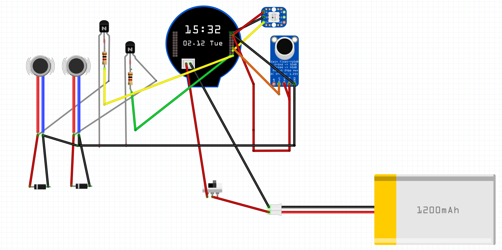

# Magic (GPT)8 Ball 🎱

## Overview
The Magic (GPT)8 Ball is a modern take on the classic fortune-telling toy, combining hardware and AI to create an interactive experience. When shaken, it records your spoken question through a microphone, processes it using ChatGPT, and displays a mystical response on its built-in screen. The device features motion detection, voice recording, and wireless connectivity for real-time AI responses.

## How It Works
1. The device uses an accelerometer/gyroscope (QMI8658) to detect when you shake it
2. When shaken, it activates the microphone to record your question
3. The recording is sent to OpenAI's Whisper API for speech-to-text conversion
4. The text is then processed by ChatGPT to generate a mystical response
5. The response appears on the circular LCD display

## Hardware Requirements



### Core Components
- Waveshare ESP32-S3 1.28" LCD Development Board
  - Built-in 1.28" Round LCD Display (240×240 resolution)
  - ESP32-S3 microcontroller
  - QMI8658 6-axis IMU (accelerometer + gyroscope)
- MAX9814 Microphone Amplifier Module
- 1200mAh LiPo Battery

### Additional Components
- JST connectors for battery
- Wires for connecting components
- 3D printed case (design files TBD)

## Pin Connections

### LCD Display (Built into ESP32-S3 board)
- LCD_DC: GPIO8
- LCD_CS: GPIO9
- LCD_CLK: GPIO10
- LCD_MOSI: GPIO11
- LCD_RST: GPIO12
- LCD_BL: GPIO40 (Backlight)

### MAX9814 Microphone
- VDD -> 3.3V
- GND -> GND
- OUT -> GPIO2 (ADC1_CH1)
- AR -> Not connected
- GAIN -> Not connected (default gain)

### QMI8658 IMU (Built into ESP32-S3 board)
- SDA: GPIO6
- SCL: GPIO7

## Software Setup

### Prerequisites
1. Install Visual Studio Code
2. Install PlatformIO IDE extension
3. Install Git

### Building the Project
1. Clone the repository:
   ```bash
   git clone https://github.com/NickEngmann/MagicGPT8Ball.git
   cd MagicGPT8Ball
   ```

2. Open the project in VS Code with PlatformIO

3. Install dependencies:
   - WiFiManager for network configuration
   - ArduinoJson for API communication
   - LVGL for display graphics
   - TFT_eSPI for display driver

4. Set up val.town account:
   - Create account at val.town
   - Deploy the val.town.js function from the repository
   - Copy your function URL

5. Configure the project:
   - Copy your val.town function URL to main.cpp
   - Update WiFi credentials (or use WiFiManager portal)

6. Build and upload:
   ```bash
   pio run --target upload
   ```

## Usage

1. Power on the device using the switch
2. On first boot, connect to the "MagicGPT8Ball" WiFi network
3. Follow the portal instructions to configure your WiFi
4. Once connected, the display will show "Magic GPT8 Ball - Shake me"
5. Shake the device to start recording
6. Ask your question while the red recording indicator is shown
7. Wait for the mystical response to appear

### Offline Mode
- If WiFi is not available, the device will fall back to classic Magic 8 Ball responses
- No internet connection is required for basic functionality

## Development

### Project Structure
- `src/main.cpp`: Main application code
- `src/Animations.*`: Display animation handling
- `src/Recorder.*`: Audio recording functionality
- `src/TextStateManager.*`: Display text state management
- `lib/`: External libraries and drivers
- `val.town.js`: Serverless function for API processing

### Key Features
- Voice-activated recording with silence detection
- Motion-based activation using 6-axis IMU
- Smooth animations and transitions
- Fail-safe offline mode
- WiFi manager for easy network configuration
- PSRAM utilization for audio buffer

## Troubleshooting

### Common Issues
1. Device not recording
   - Check microphone connections
   - Verify ADC pin configuration
   - Check serial output for voltage levels

2. No WiFi connection
   - Reset WiFi settings by holding boot button
   - Check serial output for connection status
   - Verify network credentials

3. No response from ChatGPT
   - Check val.town function URL
   - Verify internet connection
   - Monitor serial output for API responses

### Debug Mode
Enable debug output by uncommenting `#define ENABLE_DEBUG` in Recorder.h

## Contributing

1. Fork the repository
2. Create a feature branch
3. Make your changes
4. Submit a pull request

## License
This project is licensed under the MIT License. See LICENSE file for details.

## Acknowledgments
- OpenAI for ChatGPT and Whisper APIs
- Waveshare for ESP32-S3 development board
- LVGL team for graphics library
- val.town for serverless function hosting